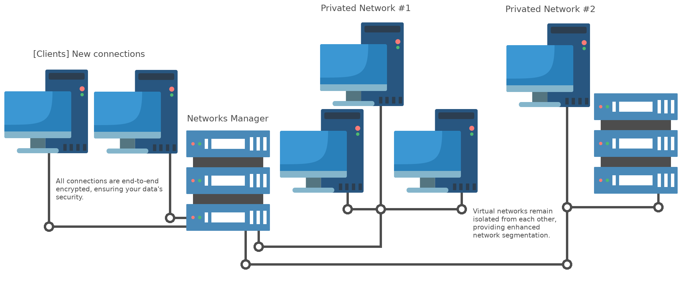

# Simple VPN

This project consists of a client and server VPN that allows you to create virtual networks without the need to create new network interfaces on the server. It was primarily developed to enhance my skills in socket programming, thread management, and selectors. To create virtual network interfaces on the client side, the pytun library is used, and user and network information is stored in a MongoDB database.

<p style="text-align: center">

</p>

## Server Features
- Credential Security: User passwords are not stored in plain text, ensuring enhanced security.
- Transfer Statistics: Real-time statistics on the data transfer rate for each user account.
- Multi-Threading: Each connection is managed in a separate thread, enabling efficient handling of multiple connections.
- Independent Virtual Networks: Each created network is independent, increasing user privacy.
- End-to-End Encryption: The connection is end-to-end encrypted, meaning only the server and client have access to the token for decrypting packets.

## Future Features
- Full Routing: Implementing the ability to access any address from the VPN client when the server has this feature enabled.
- Add a transfer rate limit: Implementing a maximum data transfer speed for VPN connections.

## How to Create a Server
You can create a VPN server as follows:

```python
from pymongo import MongoClient
from connection import VPNServer

client = MongoClient("mongodb://localhost:27017/")
vpn_server = VPNServer(client, 'test_network')
# Optionally, you can specify an IP address.
vpn_server.ip_address = '127.0.0.1'
vpn_server.run_server(port=5732)
```

## How to Connect to the Server
To connect to the VPN server, you can follow these steps:

```python
from connection import VPNClient

# Specify the server's address and port.
vpn_client = VPNClient(('127.0.0.1', 5732))
# Replace with the appropriate credentials.
credentials = 'Username', 'password123*'
vpn_client.connect(credentials, 'my_interface')
```